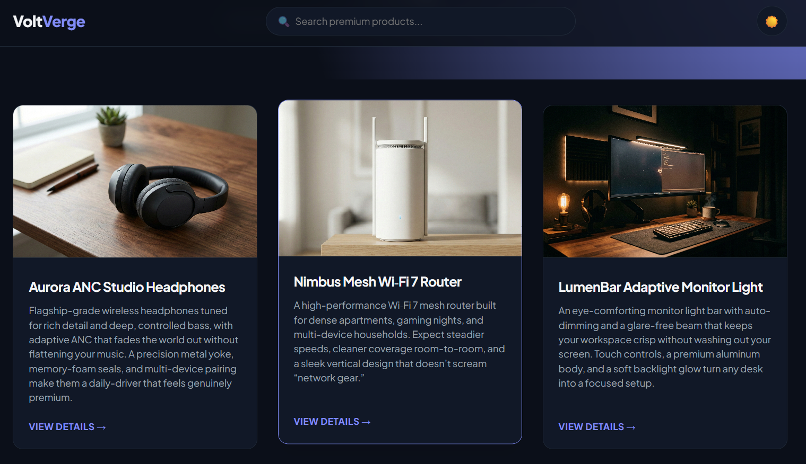

# 🧠 Sentiment Analysis Web Application
The Sentiment Analysis Web Application is a Flask-based web application designed to analyze the sentiment of text reviews. The application utilizes machine learning models to classify text as positive, neutral, or negative. The core features of the application include loading machine learning models, defining API endpoints for handling requests and responses, and integrating with a frontend interface for user interaction.

## 🚀 Features
- **Machine Learning Model Integration**: The application loads pre-trained machine learning models for sentiment analysis.
- **API Endpoints**: The application defines API endpoints for handling HTTP requests and responding with sentiment analysis results.
- **Frontend Interface**: The application integrates with a frontend interface for users to input text reviews and view sentiment analysis results.
- **Data Storage**: The application stores cleaned and formatted review data in a CSV file.

## 🛠️ Tech Stack
- **Backend**: Flask
- **Machine Learning**: scikit-learn, joblib
- **Data Manipulation**: pandas
- **Frontend**: HTML, CSS, JavaScript
- **Database**: CSV files for data storage

## 📦 Installation
To install the required dependencies, run the following command:
```bash
pip install flask flask-cors joblib numpy pandas
```
### Prerequisites
- Python 3.8 or higher
- pip 20.0 or higher

### Running Locally
1. Clone the repository: `git clone https://github.com/your-username/your-repo-name.git`
2. Navigate to the project directory: `cd your-repo-name`
3. Install dependencies: `pip install -r requirements.txt`
4. Run the application: `python app.py`

## 💻 Usage
1. Open a web browser and navigate to `http://localhost:5000`
2. Input a text review in the text area
3. Click the "Analyze Sentiment" button to view the sentiment analysis result

## 📂 Project Structure
```markdown
VoltVerge/ (Main Project Directory)
│
├── app.py                      # Flask backend logic & product data
├── final_agent_model.pkl       # Trained ML model (62 MB)
├── final_agent_vectorizer.pkl  # ML vectorizer (TF-IDF/Count)
├── cleaned_reviews.csv         # Dataset used for training/reference
├── README.md                   # Project documentation 
│
├── static/                     # Publicly accessible files
│   ├── favicon.ico             # Website logo for the browser tab
│   ├── style.css               # Modern Indigo UI styling
│   ├── script.js               # Search, Theme toggle, & Chart.js logic
│   └── images/                 # Your 9 premium product images
│       ├── 1_image.png
│       ├── 2_image.png
│       ├── ...
│       └── 9_image.png
│
└── templates/                  # HTML UI files
    ├── index.html              # Homepage with product grid
    └── product.html            # Detailed product view & AI reviews
```
## Screenshot


## 🤝 Contributing
Contributions are welcome! To contribute, please fork the repository, make changes, and submit a pull request.

## 📝 License
This project is licensed under the MIT License.

## 📬 Contact
For questions or concerns, please contact [Sathya R V](mailto:your-sathya07rv@gmail.com).

## 💖 Thanks Message
This project was made possible by the contributions of many individuals. Thank you to everyone who has contributed to this project! 
